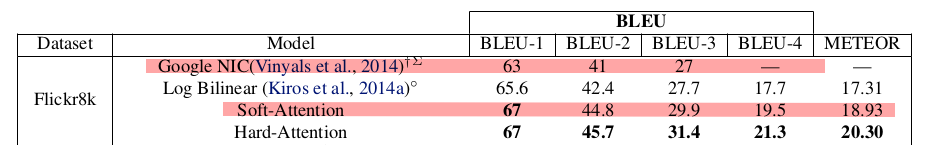
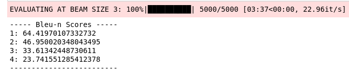

# Image Captioning using Pytorch
Current Implementation -> 
[Show, Attend, and Tell](https://arxiv.org/abs/1502.03044)

### Papers' results

- The Goggle NIC was the first implementation from the paper "Show and Tell"
- Soft-Attention is the result I'm comparing to. I'm not comparing to Hard-Attention as it's trainable by maximizing an approximate vairational lower bound (REINFORCE) while Soft-Attention is trainable by standard back-propagation.

### My Best Results (top bleu-4)

- using a beam size of 3:

    

    - Bleu-1 is lower than the results of the paper, this maybe due to one or all of the below reasons:
        - We are using a smaller vocabulary size so the model has less number of words in its knowledge.
        - While training, validation and also testing we are trying to get the highest bleu-4 so we ignored higher bleu-1 before because it has lower bleu-4.
            - The beam search also finds the sequences with the highest score which depends on the loss function.
            - And we chose the best model based on bleu-4 only.
    - The other bleu scores are higher as they depend more on the pairs of words which is our main optimization goal

[Implementaiton Differences Table](https://www.notion.so/a168d58b9e194572bb33d232bd782a8d)

